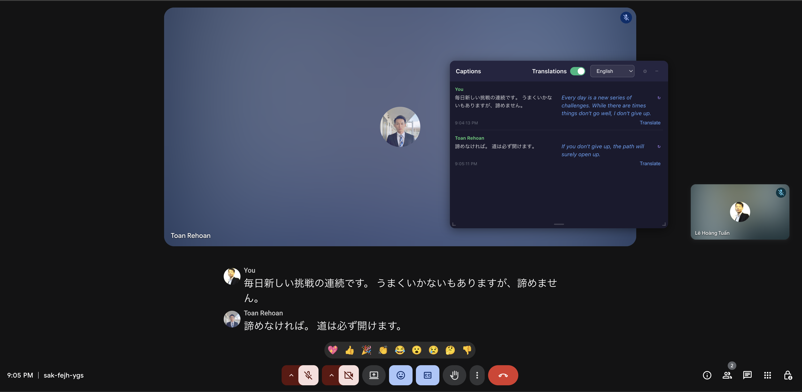

# MeetCaptioner

[English](README.md) | [Tiếng Việt](README-vi.md) | [简体中文](README-zh-CN.md) | [繁體中文](README-zh-TW.md) | [日本語](README-ja.md) | [한국어](README-ko.md) | Español | [Português](README-pt.md) | [Русский](README-ru.md) | [ไทย](README-th.md)

Una potente extensión de Chrome que captura los subtítulos de Google Meet en tiempo real y ofrece traducción en directo mediante IA.


## Características

- **Captura de subtítulos en tiempo real** - Captura automáticamente los subtítulos de Google Meet e identifica al hablante
- **Traducción con IA en directo** - Traduce a más de 40 idiomas con OpenAI, Anthropic, Google Gemini, DeepSeek u Ollama (local/nube)
- **Panel flotante** - Se puede mover y redimensionar sin interferir con la reunión
- **Historial de reuniones** - Guarda automáticamente todos los subtítulos de forma local
- **Opciones de exportación** - Exporta subtítulos y traducciones a archivos de texto
- **Traducciones editables** - Haz clic en cualquier traducción para editarla
- **Cambio inteligente de modelo** - Cambia automáticamente de modelo al alcanzar límites de uso
- **Privacidad ante todo** - Todos los datos se guardan localmente, sin servidores externos

## Capturas de pantalla



_Captura y traducción de subtítulos con IA en Google Meet_

## Instalación

### Desde el código fuente

1. **Clona el repositorio**

   ```bash
   git clone https://github.com/LeHoangTuanbk/MeetCaptioner
   cd meet-captioner
   ```

2. **Instala las dependencias**

   ```bash
   pnpm install
   ```

3. **Compila la extensión**

   ```bash
   # Modo de desarrollo con recarga automática
   pnpm dev

   # Compilación para producción
   pnpm build
   ```

4. **Carga la extensión en Chrome**
   - Abre `chrome://extensions/`
   - Activa el “Modo de desarrollador”
   - Haz clic en “Cargar descomprimida”
   - Selecciona el directorio `.output/chrome-mv3`

### Desde una versión publicada

1. Descarga el `.zip` más reciente desde [Releases](https://github.com/LeHoangTuanbk/MeetCaptioner/releases)
2. Extrae el archivo ZIP
3. Cárgalo en Chrome siguiendo los pasos anteriores

## Configuración

1. Haz clic en el icono de la extensión y abre **Settings**
2. Elige un proveedor de IA (OpenAI, Anthropic, Google Gemini, DeepSeek u Ollama)
3. Introduce tu clave API o configura la URL de Ollama para un LLM local
4. Selecciona el modelo y el idioma de destino
5. Activa la traducción en el panel flotante

### Proveedores de IA compatibles

| Proveedor | Modelos |
| --------- | ------- |
| OpenAI | GPT-4.1 Nano, GPT-4.1 Mini, GPT-5 Nano |
| Anthropic | Claude Haiku 4.5, Claude Sonnet 4.5, Claude Opus 4.5 |
| Gemini | Gemini 3.1 Flash-Lite, Gemini 3.5 Flash, Gemini 3.1 Pro (Preview) |
| DeepSeek | DeepSeek Flash |
| Ollama | Cualquier modelo local (Qwen, Llama, Gemma, etc.) u Ollama Cloud |

> **Nota:** Ollama local requiere configurar CORS. Consulta la [guía de configuración](https://objectgraph.com/blog/ollama-cors/).
>
> **Gemini:** Obtén una clave API gratuita en [Google AI Studio](https://aistudio.google.com/app/apikey).

### Idiomas compatibles

Tiếng Việt (Vietnamese), English (English), 廣東話（繁體） (Chinese, Cantonese (Traditional)), 普通话（简体中文） (Chinese, Mandarin (Simplified)), 國語（繁體中文） (Chinese, Mandarin (Traditional)), 日本語 (Japanese), 한국어 (Korean), Español (Spanish), Français (French), Deutsch (German), Português (Portuguese), Русский (Russian), العربية (Arabic), हिन्दी (Hindi), Italiano (Italian), ไทย (Thai), Монгол (Mongolian), မြန်မာ (Burmese), Bahasa Indonesia (Indonesian), Nederlands (Dutch), Polski (Polish), Türkçe (Turkish), বাংলা (Bengali), اردو (Urdu), Bahasa Melayu (Malay), Filipino (Filipino), தமிழ் (Tamil), తెలుగు (Telugu), मराठी (Marathi), ગુજરાતી (Gujarati), ਪੰਜਾਬੀ (Punjabi), Українська (Ukrainian), Čeština (Czech), Română (Romanian), Magyar (Hungarian), Ελληνικά (Greek), Svenska (Swedish), Dansk (Danish), Norsk (Norwegian), Suomi (Finnish), עברית (Hebrew), فارسی (Persian), Kiswahili (Swahili), Català (Catalan), Български (Bulgarian), Српски (Serbian)

## Tecnologías

- **Framework**: [WXT](https://wxt.dev)
- **UI**: React 19 + TypeScript
- **Estilos**: Tailwind CSS 4
- **Compilación**: Vite
- **Gestor de paquetes**: pnpm

## Estructura del proyecto

```text
meet-captioner/
├── entrypoints/
│   ├── content/          # Captura de subtítulos y panel flotante
│   ├── background.ts     # Service worker
│   ├── popup/            # Ventana emergente
│   ├── options/          # Página de configuración
│   └── history/          # Historial de reuniones
├── public/               # Recursos estáticos
└── wxt.config.ts         # Configuración de WXT
```

## Desarrollo

```bash
# Inicia el servidor de desarrollo
pnpm dev

# Compila para producción
pnpm build

# Crea el ZIP de distribución
pnpm zip
```

## Contribuciones

Las contribuciones son bienvenidas. Puedes enviar un Pull Request:

1. Haz un fork del repositorio
2. Crea una rama (`git checkout -b feature/amazing-feature`)
3. Confirma los cambios (`git commit -m 'Add some amazing feature'`)
4. Sube la rama (`git push origin feature/amazing-feature`)
5. Abre un Pull Request

### Guía de desarrollo

- Sigue el estilo de código existente
- Escribe mensajes de commit claros
- Prueba los cambios cuidadosamente
- Actualiza la documentación cuando sea necesario

## Licencia

Este proyecto se publica bajo la licencia MIT. Consulta [LICENSE](LICENSE) para más información.

## Agradecimientos

- [WXT](https://wxt.dev) por su excelente framework para extensiones
- [Tailwind CSS](https://tailwindcss.com) por sus utilidades CSS
- [OpenAI](https://openai.com), [Anthropic](https://anthropic.com), [Google Gemini](https://ai.google.dev), [DeepSeek](https://www.deepseek.com) y [Ollama](https://ollama.com) por sus API de IA

---

Creado con dedicación por [Le Hoang Tuan](https://github.com/LeHoangTuanbk).
